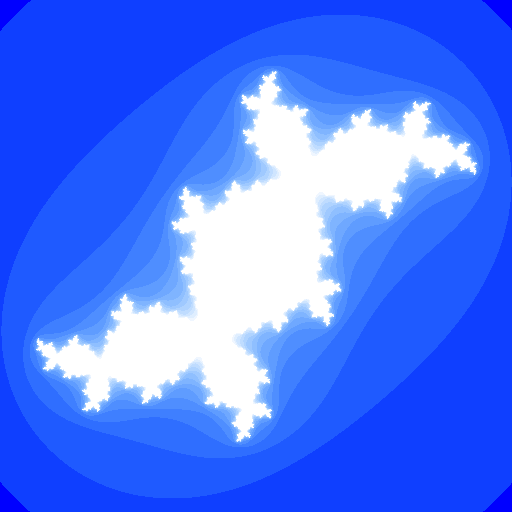

# Julia Set

## Sample Purpose

This is another sample that generates a fractal image.
It uses an OpenCL kernel to compute a [Julia set](https://en.wikipedia.org/wiki/Julia_set) image, which is then written to a BMP file.
Each OpenCL work item computes one element of the set.

By default, similar to prior samples, this sample does not specify a local work size when it enqueues an ND range for the kernel into an OpenCL command queue.
This enables the OpenCL implementation to determine how to group work items, and is a reasonable best practice when work items may execute in any grouping.
Unlike prior samples, however, this sample can optionally specify a local work size grouping.
The local work size grouping is one way to tune an application for an architecture.
Can you find a local work size grouping that performs better than the implementation-determined grouping?
Is there a local work size grouping that performs very poorly on your implementation?

Note that because this kernel is compiled as an OpenCL 1.x kernel, the local work size grouping must evenly divide the global work size.
Since the default global work size is a power of two, this means that the local work size grouping must also be a power of two.

This sample also demonstrates how to measure the wall clock time for an OpenCL kernel.
Note especially how `clFinish` is used to ensure that the OpenCL command queue is empty before starting the timer, and that all processing is complete before stopping the timer.



As with prior samples, the source code for the OpenCL kernel is embedded into the host code as a raw string, and by default, this sample will run in the first enumerated OpenCL device on the first enumerated OpenCL platform.
To run on a different OpenCL device or platform, please use the provided command line options.

## Key APIs and Concepts

This example shows how to specify a local work size grouping when a kernel is enqueued into an OpenCL command queue.
It also demonstrates how to measure the performance of an OpenCL kernel.

```c
clEnqueueNDRangeKernel with a local work size
clFinish
```

## Command Line Options

| Option | Default Value | Description |
|:--|:-:|:--|
| `-d <index>` | 0 | Specify the index of the OpenCL device in the platform to execute on the sample on.
| `-p <index>` | 0 | Specify the index of the OpenCL platform to execute the sample on.
| `-i <number>` | 16 | Specify the number of iterations to execute.
| `--gwx <number>` | 512 | Specify the global work size to execute, in the X direction.  This also determines the width of the generated image.
| `--gwy <number>` | 512 | Specify the global work size to execute, in the Y direction.  This also determines the height of the generated image.
| `--lwx <number>` | 0 | Specify the local work size in the X direction.  If either local works size dimension is zero a `NULL` local work size is used.
| `--lwy <number>` | 0 | Specify the local work size in the Y direction.  If either local works size dimension is zero a `NULL` local work size is used.
