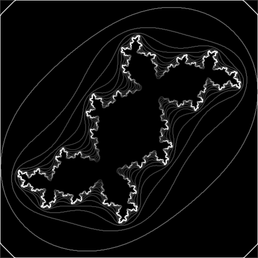

# Sobel Filter

## Sample Purpose

This is an enhanced version of the earlier Julia set sample.
Unlike the previous sample that simply generated Julia set image, this sample executes a [Sobel edge detection filter](https://en.wikipedia.org/wiki/Sobel_operator) on the generated Julia set.



## Key APIs and Concepts

This example shows how to include two different kernels in the same program source string.
This example also shows how both kernels can be enqueued asynchronously into the same in-order queue.

```c
clCreateProgramWithSource with two kernels in the source string
clCreateKernel
```

## Command Line Options

| Option | Default Value | Description |
|:--|:-:|:--|
| `-d <index>` | 0 | Specify the index of the OpenCL device in the platform to execute on the sample on.
| `-p <index>` | 0 | Specify the index of the OpenCL platform to execute the sample on.
| `-i <number>` | 16 | Specify the number of iterations to execute.
| `--gwx <number>` | 512 | Specify the global work size to execute, in the X direction.  This also determines the width of the generated image.
| `--gwy <number>` | 512 | Specify the global work size to execute, in the Y direction.  This also determines the height of the generated image.
| `--lwx <number>` | 0 | Specify the local work size in the X direction.  If either local works size dimension is zero a `NULL` local work size is used.
| `--lwy <number>` | 0 | Specify the local work size in the Y direction.  If either local works size dimension is zero a `NULL` local work size is used.
