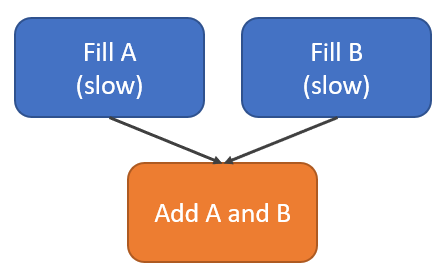

# ooqcommandbuffers

## Sample Purpose

This is an intermediate-level sample that demonstrates how to use the OpenCL extension [cl_khr_command_buffer](https://www.khronos.org/registry/OpenCL/specs/3.0-unified/html/OpenCL_Ext.html#cl_khr_command_buffer) to create a command buffer that may execute out-of-order.
Using an out-of-order command buffer may improve performance by allowing commands in a command buffer to execute in parallel.

An out-of-order command buffer is created by passing an out-of-order command queue to `clCreateCommandBufferKHR`.

This sample works by creating a command buffer with two relatively slow kernels to initialize two buffers followed by a faster data parallel kernel to add the two buffers together.



There are no dependencies between the two relatively slow kernels but they must both complete before the data parallel kernel can execute.
If the command buffer is an in-order command buffer then the two relatively slow kernels must execute sequentially.
If the command buffer is an out-or-order command buffer, however, the two relatively slow kernels may execute in parallel, which may improve the execution time of the command buffer.
Note that there is no requirement to execute the two relatively slow kernels in parallel, and therefore some implementations may not see a performance improvement with an out-of-order command buffers.
For some implementations though, the out-of-order command buffer will execute almost twice as fast as the same in-order command buffer!

This sample also requires an implementation that supports out-of-order command queues and out-of-order command buffers.
These are optional capabilities that may not be supported by all OpenCL devices.
If a device supports out-of-order command queues the sample may run using the [cl_khr_command_buffer emulation layer](../../layers/10_cmdbufemu).

This sample requires the OpenCL Extension Loader to get the extension APIs for command buffers.

## Key APIs and Concepts

This sample demonstrates how to create and execute a command buffer that may execute out-of-order.
This sample also demonstrates how to time commands in an out-or-order command queue.

```c
CL_DEVICE_COMMAND_BUFFER_CAPABILITIES_KHR_
clCommandNDRangeKernelKHR with sync points
clEnqueueBarrierWithWaitList
```

## Command Line Options

| Option | Default Value | Description |
|:--|:-:|:--|
| `-d <index>` | 0 | Specify the index of the OpenCL device in the platform to execute on the sample on.
| `-p <index>` | 0 | Specify the index of the OpenCL platform to execute the sample on.
| `--ioq` | n/a | Execute the sample in-order instead of out-of-order.
| `-i <number>` | 16 | Specify the number of iterations to execute.
| `-e <number>` | 1M | Specify the number of 32-bit integers in each buffer.
